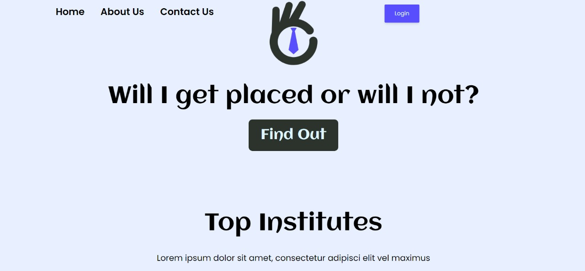

<!-- PROJECT LOGO -->

 

  

<h2 align="center">PlaceIndia</h2>

<h3 align="center">Solution for Cyscom's HackOverflow Hackathon 2022</h3>
 
   

 
  
<!-- TABLE OF CONTENTS -->

Table of Contents

<ol>
<li><a  href="#getting-started">Getting Started</a>
<ul>
<li><a  href="#problem-statement">Problem Statement</a></li>
</ul>
<ul>
<li><a  href="#about-the-problem">About The Problem</a></li>
</ul>
<ul>
<li><a  href="#our-approach">Our Approach</a></li>
</ul>
</li>
<li><a  href="#flow-diagram">Flow Diagram</a></li>
<li><a  href="#tech-architecture">Tech Architecture</a></li>
<li><a  href="#built-with">Built With</a></li>
<li><a  href="#features-and-interfaces">Features and Interfaces</a></li>
<li><a  href="#discussions">Discussions</a></li>
</ol>

<!-- GETTING STARTED -->
##  Getting Started
###  Problem Statement
* Colleges in India don't have a central database regarding campus placement in technical and business institutes and universities.
* By mapping and collating the placement details from throughout the county, the percentage of unemployability, the average salary and benefits, and other details can be identified in various fields of education.
* Help the policy makers to come out with appropriate solutions through framing of policies, based on data from this database, for tackling the unemployability in the country.
###  About The Problem
* Unemployment in India is rising at an alarming rate in India, despite several technical and business institutes booming across the country.
* Though education level in recent years has improved, skill development is still a crucial issue.
* India has the largest population of youth in the world. Around 65 per cent of the population of India is under the age of 35, so the impact of the declining financial market and the lack of job opportunities has the worst effect in India.

###  Our Approach
* Unemployment in India is rising at an alarming rate in India, despite several technical and business institutes booming across the country.
* Though education level in recent years has improved, skill development is still a crucial issue.
* India has the largest population of youth in the world. Around 65 per cent of the population of India is under the age of 35, so the impact of the declining financial market and the lack of job opportunities has the worst effect in India.

(<a  href="#top">back to top</a>)

  
  
  

<!-- ARCHITECTURE DIAGRAMS -->

##  Flow Diagram

(<a  href="#top">back to top</a>)

  

<!-- ARCHITECTURE DIAGRAMS -->

##  Tech Architecture

(<a  href="#top">back to top</a>)

##  Built With
To achieve our goal, we made use of the following tools and languages,

 
            
 

 and other technologies like,
 Google Auth, NLTK, PyPdf2, SpaCy for extracting keywords from pdfs, Gensim for NLP, Recharts, Machine Learning Algorithms like Logistic Regression, SVM, Artificial Neural Networks and so on.
 

(<a  href="#top">back to top</a>)

##  Features and Interfaces
* Data Analytics Dashboard

* Policy Generation

* Chat Bot for FAQs

* Resume Rater

(<a  href="#top">back to top</a>)

<!-- DISCUSSIONS -->

##  Discussions
- Centralized Database
  Columns include,
  - gender
  - category
  - sscp (10th percentage)
  - ssc (10th board)
  - hscp (12th percentage)
  - hsc (12th board)
  - hsc_stream (12th stream science/biology/commerce)
  - batch (year of joining degree)
  - degree_p (cgpa)
  - sat (standardized test scores)
  - workex (previous work experience)
  - hosteller 
  - backlogs
  - status (placed or not)
  - package
  - year_of_placement
  - college

- Populating the dataset
  - Heatmap of dataset
  - 
  - The heatmap gives us the correlation between two columns. Using this information we can see how if correlation increases with one feature, it decreases with the other, to maintain the correlation of the overall dataset. This is to prevent outliers and extreme variation. We do this to populate our dataset to show how scalabe our solution is.
  
- ML prediction before applying policy
  - rate of unemployability
  - 
  - Status of placements
  - 

 - ML prediction after Applying Policy
   - rate of unemployability
  - 
  - Status of placements
  - 

 
(<a  href="#top">back to top</a>)

  
